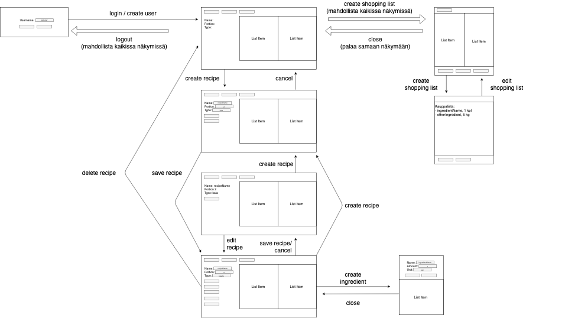
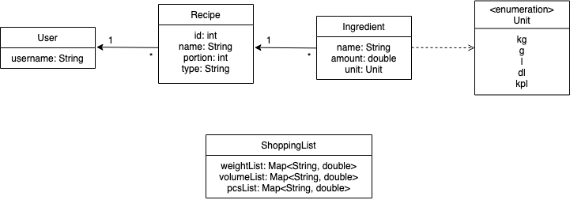
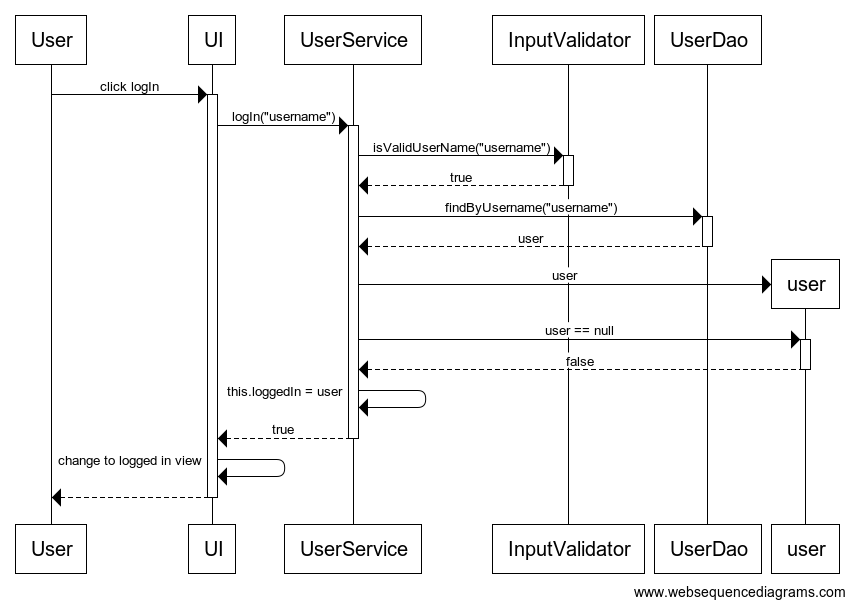
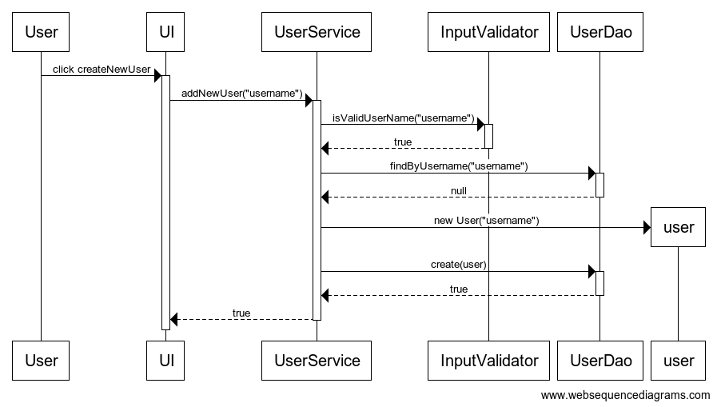
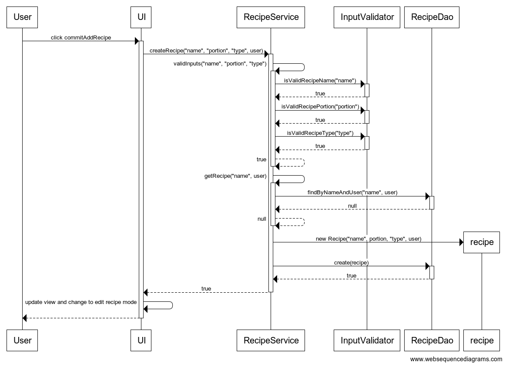
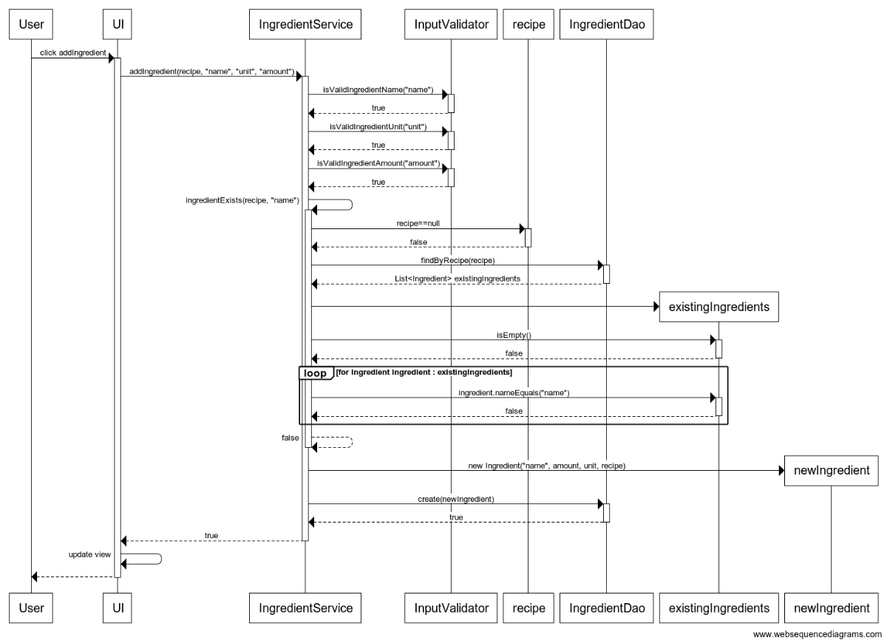

# Arkkitehtuurikuvaus

## Rakenne

Ohjelma koostuu neljästä pakkauksesta:
* Pakkaus *generator.ui* sisältää JavaFX:llä toteutetun käyttäliittymän
* Pakkaus *generator.models* sisältää sovelluksen käyttämät datamallit
* Pakkaus *generator.services* sisältää sovelluksen käyttämät datamallit
* Pakkaus *generator.dao* sisältää tietojen pysyväistallennuksesta vastaavat luokat
  * Alipakkaus *generator.dao.sql* sisältää tietojen tallennuksesta tietokantaan vastaavat luokat
  * Alipakkaus *generator.dao.file* sisältää tietojen tallennuksesta tiedostoon vastaavat luokat 

Ohjelman rakenne voidaan tulkita kolmitasoisena kerrosarkkitehtuurina, joka koostuu käyttöliittymästä (pakkaus *generator.ui*), sovelluslogiikasta (pakkaukset *generator.models* ja *generator.services*) sekä tietojen pysyväistallennuksesta (pakkaus *generator.dao*).


## Käyttöliittymä

Käyttöliittymä sisältää neljä erillistä näkymää

* sisäänkirjautuminen-näkymä
* resepti-näkymä
* ainesosa-näkymä
* kauppalista-näkymä



Jokainen näkymä on toteutettu omana Scene-olionaan. Sisäänirjautuminen- ja resepti-näkymistä vain toinen voi olla kerrallaan näkyvänä ja ne sijoitetaan vuorollaan sovelluksen pää-stagelle. Ainesosa- ja kauppalista-näkymät puolestaan sijoitetaan erillisiin stageihin, jotka aukeavat omiin ikkunoihinsa. Käyttäliittymän toteutukseen liityvät luokat löytyvät pakkauksesta *generator.ui*. Jokainen näkymä on luotu omassa luokassaan. Lisäksi pakkauksessa on luokka *Router*, joka vastaa näkymien kutsumisesta ja tarvittaessa ikkunoiden avaamisesta ja sulkemisesta.

Näkymien luomisesta vastaavat luokat toteuttavat rajapinnan *View* jossa on yksi metodi, *create()*. Rajapinta on luotu käyttöliittymän jatkokehitystä silmällä pitäen.

Käyttöliittymä on pyritty eriyttämään sovelluslogiikasta. Sen luokat ainoastaan kutsuvat sovelluslogiikan toteuttavien olioiden metodeja sopivilla parametreilla.

## Sovelluslogiikka

Sovelluksen keskeisen loogisen datamallin muodostavat seuraavat viisi luokkaa:

* *User*, joka kuvaa käyttäjiä
* *Recipe*, joka kuvaa käyttäjälle kuuluvaa reseptiä
* *Ingredient*, joka kuvaa reseptiin liittyvää ainesosaa
* *ShoppingList*, joka sisältää reseptien ja ainesosien perusteella luotavan kauppalistan tiedot
* *Unit*, joka on enum-tyyppinen ja määrittelee ainesosalle hyväksyttävät mittayksiköt. 



Toiminnallisista kokonaisuuksista vastaavat luokat *UserService*, *RecipeService*, *IngredientService*, *ShoppingListService* ja *InputValidator*. Jokaisesta luokasta luodaan vain yksi olio. Luokat on kuvattu tarkemmin alla olevassa taulukossa

|Luokka|Tehtävä|Esimerki metodeista|
|---|---|---|
|UserService|Käyttäjien käsittely|logIn(User user)|
|RecipeService|Reseptien käsittely|removeRecipe(Recipe recipe, User user)|
|IngredientService|Ainesosien käsittely|addIngredient(Recipe recipe, String ingredientName, String ingredientUnit, String ingredientAmount)|
|ShoppingListService|Ostoslistan luominen|createShoppingList(List<Recipe> recipes)|
|InputValidator|Syötteiden validointi|isValidIngredientUnit(String input)|

Sovelluslogiikasta vastaavat luokat pääsevät käsiksi käyttäjien, reseptien ja ainesosien tietoihin pakkauksessa *generator.dao* sjijaitsevien, rajapinnat UserDao, RecipeDao ja IngredientDao toteuttavien luokkien kautta. Tarvittavien luokkien toteutukset injektoidaan sovelluslogiikkaa toteuttaville olioille konstruktorikutsun yhteydessä. Service-olioihin injektoidaan lisäksi InputValidator-luokan toteutus.

Alla sovelluksen arkkitehtuuria kuvaava luokka/pakkauskaavio. Jonkinasteisen luettavuuden säilyttämiseksi kaaviossa _ei ole_ eritelty pakkauksen *generator.service* luokkien suhteita pakkauksen *generator.dao* luokkiin. Näiden pakkauksien luokkien väliset suhteet ovat suoraviivaiset: *UserService*-luokkaan liittyy tasan yksi *UserDao*-rajapinnan toteuttava luokka, *RecipeService*-luokkaan liittyy tasan yksi *RecipeDao*-rajapinnan toteuttava luokka,  ja *IngredientService*-luokkaan liittyy tasan yksi *IngredientDao*-rajapinnan toteuttava luokka, minkä lisäksi *ShoppingListService*-luokkaan liittyy tasan yksi *IngredientService*-rajapinnan toteuttava luokka.


## Pysyväistallennus
Pakkauksen *generator.dao.sql* luokat *SQLUserDao*, *SQLRecipeDao* ja *SQLIngredientDao* huolehtivat tietojen tallentamisesta tietokantaan, kun taas pakkauksen *generator.dao.file* luokat *FileUserDao*, *FileRecipeDao* ja *FileIngredientDao* huolehtivat tietojen tallettamisesta tiedostoihin. Käyttäjä voi konfiguraatiotiedoston avulla määritellä, kumpaa tallennustapaa haluaa käyttää ensisijaisesti. Mikäli preferoidun tallennustavan käyttäminen ei jostain syystä onnistu, yrittää sovellus toissijaisesti käyttää talennukseen toista tapaa. Mikäli kumpikaan tallennustavoista ei onnistu, ohjelma ei käynnisty.

Sovelluksen pysyväistallennus noudattaa Data Access Object -suunnittelumallia, ja se on eristetty rajapintojen *UserDao*, *RecipeDao* ja *IngredientDao* taakse. Koska sovelluslogiikka ei käytä luokkia suoraan, ne on myös mahdollista korvata uusilla vaihtoehtoisilla toteutuksilla mikäli datan talletustapaa halutaan jatkossa vaihtaa. Myös sovelluslogiikan testauksessa hyödynnetään DAO-suunnittelumallia. Testeissä käytetään olioita *FakeUserDao*, *FakeRecipeDao* ja *FakeIngredientDao*, jotka tekevät väliaikaisia tallennuksia keskusmuistiin pysyväistallentamisen sijaan.

### Tietokannat

Sovellus voi tallentaa käyttäjien, reseptien ja ainesosien tiedot tekstitiedostoihin. Sovelluksen *resources*-kansiosta löytyvä *config.properties*-tiedosto määrittelee tietokantatiedoston nimen, sekä käytettävän käyttäjätunnuksen ja salasanan.

Sovellus tallentaa käyttäjät *Users*-nimiseen tietokantatauluun, jossa on seuraavat sarakkeet:
* name (VARCHAR (255))

Sovellus tallentaa reseptit *Recipes*-nimiseen tietokantatauluun, jossa on seuraavat sarakkeet:
* id (INT)
* name (VARCHAR (255))
* portion (INT)
* type (VARCHAR (255))
* user (VARCHAR (255))

Sovellus tallentaa ainesosat *Ingredients*-nimiseen tietokantatauluun, jossa on seuraavat sarakkeet:
* name (VARCHAR (255))
* amount (DOUBLE)
* unit (VARCHAR (255))
* recipe_id (INT)

### Tiedostot

Sovellus voi tallentaa käyttäjien, reseptien ja ainesosien tiedot tekstitiedostoihin. Sovelluksen *resources*-kansiosta löytyvä *config.properties*-tiedosto määrittelee tekstitiedostojen nimet.

Sovellus tallentaa käyttäjät seuraavassa muodossa
```
heinapaa
lettu
uusi2
```
eli listana.

Sovellus tallentaa reseptit seuraavassa muodossa
```
3;kasvisresepti;10;kasvis;heinapaa
8;testi;10;liha;lettu
```
eli ensin reseptin tunniste, sitten otsikko, sitten annoskoko, sitten tyyppi ja lopuksi käyttäjä, johon resepti liittyy. Tiedot erotetaan toisistaan tuplapuolipisteellä (";;").

Sovellus tallentaa ainesosat seuraavassa muodossa
```
1;sokeri;5.0;dl;5
5;sokeri;1.0;l;2
```
eli ensin reseptin tunniste, sitten ainesosan otsikko, sitten määrä, sitten yksikkö, ja lopuksi ainesosan tunniste. Tiedot erotetaan toisistaan tuplapuolipisteellä (";;").

## Päätoiminnallisuudet

Alla on kuvattu sovelluksen toimintaa muutamissa keskeisissä tilanteissa, jotka liittyvät pääosin uusien olioiden luomiseen. Kaiken kaikkiaan sovelluksen toiminta seuraa usein samaa kaavaa:

1. Painikkeen painamista seuraava tapahtumakäsittelijä kutsuu sopivaa metodia sopivassa service-luokassa, käyttäen tarvittaessa kutsun parametreina käyttäjän antamia syötteitä
2. Service-luokka tarkastaa InputValidator-luokkaa hyväksi käyttäen että käytetyt syötteet ovat kelvollisia
3. Service-luokka suorittaa halutun toiminnon (kutsuen tarvittaessa sopivaa dao-luokkaa)
4. Käyttöliittymän näkymä päivitetään kun haluttu toiminto on saatu päätökseen

### Käyttäjän kirjaantuminen

Kun kirjautumisnäkymän kenttään on syötetty hyväksyttävä käyttäjänimi ja klikataan painiketta *logIn*, etenee sovelluksen kontrolli seuraavasti:



### Käyttäjän luominen

Kun kirjautumisnäkymän kenttään on syötetty hyväksyttävä käyttäjänimi jota ei ole vielä olemassa ja klikataan painiketta *createNewUser*, etenee sovelluksen kontrolli seuraavasti:



### Reseptin luominen

Kun reseptin luominen-näkymässä on syötetty/valittu kaikkiin kenttiin hyväksyttävät syötteet ja klikataan painiketta *commitAddRecipe*, etenee sovelluksen kontrolli seuraavasti:



### Ainesosan luominen

Kun ainesosan lisääminen-näkymässä on syötetty/valittu kaikkiin kenttiin hyväksyttävät syötteet ja klikataan painiketta *commitAddIngredient*, etenee sovelluksen kontrolli seuraavasti:



## Heikkoidet

### ShoppingList-luokka

Kauppalistaa kuvaava luokka voisi olla järkevämpää toteuttaa siten, että se muistaisi sisältämänsä reseptit eikä suinkaan vain listaa ainesosista (tekstimuodossa). Tämä mahdollistaisi paremmin kauppalistojen tallentamisen (yksi mahdollisista lisäominaisuuksista, joita sovellukseen voisi lisätä), ja selkeyttäisi sovelluslogiikkaa muutenkin. ShoppingList-luokkaa olisi muutenkin hyvä tarkastella uudemman kerran, ja pohtia sitä ovatko sen nyt tarjoamat metodit riittäviä/tarkoituksenmukaisia.

### Tiedoston kirjoittaminen

Sovelluksessa tapahtuu tiedoston lukemista ja kirjoittamista useammassa paikassa (FileDao-luokissa ja ShoppingList-luokassa). Tiedostojen käsittely olisi hyvä antaa yhden luokan tehtäväksi (esim. oma palvelu-tason luokka?).

### Käyttöliittymä

Käyttöliittymän toteutuksessa on kaiken kaikkiaan runsaasti parannettavaa. Esimerkiksi sovelluslogiikan ja käyttöliittymän tapahtumankäsittelijöiden välinen kommunikointi hukkuu tällä hetkellä näkymää rakentavan koodin sekaan, ja toteutus ei muutenkaan ole elegantein mahdollinen. Nyt käytössä oleva ohjelmallinen määrittely kannattaisikin varmasti jatkossa korvata kokonaan jollain muulla toteutuksella, esim.FXML-määrittelyllä.
