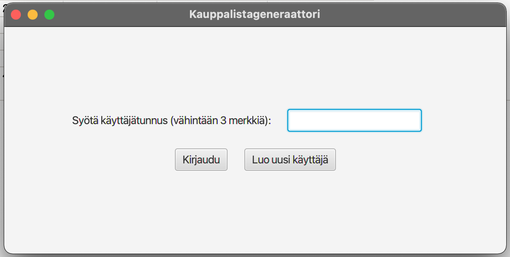

# Käyttöohje

Lataa tiedosto [Kauppalistageneraattori-1.0-SNAPSHOT.jar](https://github.com/heinapaa/ot-harjoitustyo/releases/tag/viikko6).


## Konfigurointi

Ohjelma olettaa, että sen hakemistossa on konfiguraatiotiedosto config.properties, joka määrittelee ensisijaisen tallennustyypin; tietokantatiedoston nimen, käyttäjätunnuksen ja salasanan; sekä niiden tiedostojen nimet, mihin käyttäjät, reseptit ja ainesosat tallennetaan. Oletusarvoisesti tiedosto on seuraavanlainen:
```
saveTo=1

dbName=database
dbUsername=sa
dbPassword=

userFile=users.txt
recipeFile=recipes.txt
ingredientFile=ingredients.txt
```
Ensisijainen tallennustyyppi määritellään 1. rivillä (asetus *saveTo*). Luku 1 merkitsee tietokantatallennusta ja luku 2 tiedostotallennusta. Molemmissa tapauksissa ensisijaisen metodin epäonnistuessa sovellus yrittää toissijaisesti toista metodia. Mikäli kumpikaan metodi ei onnistu, tai mikäli asetuksen syötteeksi on annettu jotain muuta kuin 1 tai 2, ohjelma sulkeutuu.

Lisäksi ohjelma hakee käynnistyshakemistosta tiedoston recipeTypes.properties, joka sisältää listan sallituista reseptityypeistä. Oletusarvoisesti tiedosto on seuraavanlainen:
```
types=kala,liha,kasvis,makea
```
Mikäli recipeTypes.properties -tiedostoa ei löydy, käyttää ohjelma hyväksyttyjen reseptityyppien oletusarvona yllä olevaa listaa (eli hyväksytyt tyypit ovat kala, liha, kasvis ja makea).

## Ohjelman käynnistäminen

Ohjelma käynnistetään komennolla

```
java -jar Kauppalistageneraattori-1.0.jar
```
Huomioi että sinun tulee olla samassa hakemistossa kuin mihin jar-tiedosto on sijoitettu komennon toimimiseksi.

## Sisäänkirjautuminen-näkymä

Sovellus käynnistyy kirjautumisnäkymään.



### Sisäänkirjautuminen

Kirjautuminen onnistuu syöttämällä olemassa oleva käyttäjänimi tekstikenttään ja painamalla nappia 'Kirjaudu'. Huomioi, että reseptinäkymään siirtymisessä saattaa kestää hetki. Ohjelma ilmoittaa, mikäli kirjautuminen ei onnistu.

### Uuden käyttäjän luominen

Uusi käyttäjä luodaan syöttämällä haluttu käyttäjänimi tekstikenttään ja painamalla nappia 'Luo uusi käyttäjä'. Käyttäjätunnuksen tulee olla vähintään 3 merkkiä pitkä, eikä sen tule sisältää välilyöntejä (nämä poistetaan) tai merkkijonoa ";;". Ohjelma ilmoittaa, mikäli käyttäjän luominen ei onnistu. Mikäli käyttäjän luominen onnistuu, ohjelma siirtyy automaattisesti reseptinäkymään. Huomioi, että kun uuden käyttäjän luonti onnistuu reseptinäkymään siirtymisessä saattaa kestää hetki.

## Resepti-näkymä

Kun kirjautuminen/uuden käyttäjän luominen onnistuu, siirtyy ohjelma reseptinäkymään.


Mikäli käyttäjällä on tallennettuja reseptejä, ne näkyvät keskimmäisessä paneelissa. Reseptilistaa klikkailemassa saa näkyviin tarkemmat tiedot reseptistä (vasemmanpuoleinen paneeli) ja listan reseptin mahdollisesti sisältämistä ainesosista (oikeanpuoleinen paneeli).

### Uuden reseptin luominen

Uuden reseptin luominen tapahtuu painamalla nappia 'Luo uusi resepti'. Vasemmanpuoleiseen paneeliin ilmestyy lomake reseptin tietojen syöttämiseksi.


Reseptin nimi ei saa olla tyhjä, eikä se saa sisältää merkkijonoa ";;". Reseptin annoskoon tulee olla kokonaisluku. Reseptin tyyppi valitaan listasta.

Kun lomake on täytetty, uusi resepti luodaan painamalla nappia 'Tallenna resepti'. Mikäli reseptiä ei halutakaan luoda, voidaan reseptin luomisesta poistua painamalla nappia 'Peruuta'. Ohjelma ilmoittaa, mikäli lomakkeeseen syötetyt tiedot eivät kelpaa tai mikäli reseptin luominen ei muusta syystä onnistu. Mikäli reseptin luominen onnistuu, ohjelma siirtyy automaattisesti reseptin muokkausnäkymään.

### Reseptin tietojen muokkaaminen

Reseptin tietojen muokkaustilaan päästään painamalla nappia 'Muokkaa reseptiä'. Nappi ilmestyy vasemmanpuoleiseen paneeliin reseptin tietojen alle, kun jokin resepti valitaan keskipaneelin listasta.


Reseptin kaikkia tietoja voidaan muokata, mutta ominaisuuksiin pätevät samat vaatimukset kuin uutta reseptiä luotaessa. Reseptin muokatut tiedot tallennetaan painamalla nappia 'Tallenna muutokset'. Mikäli muutoksia ei halutakaan tallentaa, voidaan reseptin muokkaustilasta poistua painamalla nappia 'Peruusta'. Ohjelma ilmoittaa, mikäli lomakkeeseen syötetyt tiedot eivät kelpaa tai mikäli reseptin muokkaaminen ei muusta syystä onnistu.

Muokkausnäkymässä voidaan reseptin perustietojen lisäksi lisätä ja poistaa ainesosia, sekä poistaa resepti.

### Reseptin poistaminen

Reseptin poistaminen tapahtuu painamalla nappia 'Poista resepti'. Ohjelma varmistaa vielä erikseen, halutaanko resepti todella poistaa, sillä reseptin palauttaminen ei jälkikäteen ole mahdollista. Kun resepti poistetaan, poistetaan myös kaikki siihen liittyvät ainesosat. Ohjelma ilmoittaa, mikäli reseptin poistaminen ei onnistu. Mikäli reseptin poistaminen onnistuu, ohjelma palaa automaattisesti reseptien listaukseen.

### Uloskirjatuminen

Uloskirjautuminen tapahtuu painamalla nappia 'Vaihda käyttäjää'. Ohjelma palaa tällöin sisäänkirjautumisnäkymään.

## Ainesosa-näkymä

Ainesosien lisääminen tapahtuu painamalla nappia 'Lisää ainesosa'. Tämä avaa uuden ikkunan ainesosien tietojen syöttämistä varten.


### Ainesosan lisääminen

Ainesosan nimeen pätevät samat vaatimukset kuin reseptin nimeen. Ainesosan määrän tulee olla luku. Desimaaliluvuissa käytetään erottimena pistettä. Ainesosan yksikkö valitaan listasta. Mahdollisia yksikköjä ovat kilogramma (kg), gramma (g), litra (l), desilitra (dl) ja kappale (kpl). Ohjelma ei tuo muita yksiköitä.

Kun lomake on täytetty, uusi ainesosa luodaan painamalla nappia 'Lisää ainesosa'. Mikäli ainesosaa ei halutakaan luoda, voidaan ainesosan luomisesta poistua painamalla nappia 'Sulje ikkuna'. Ohjelma ilmoittaa, mikäli lomakkeeseen syötetyt tiedot eivät kelpaa tai mikäli ainesosan luominen ei muusta syystä onnistu. Mikäli ainesosan luominen onnistuu, lisätään sen lomakkeen alla olevalle listalle. Ohjelma tyhjentää lomakkeen, ja siihen voidaan syöttää seuraavan ainesosan tiedot.

Kun kaikki halutut ainesosat on syötetty, näkymästä poistutaan joko painamalla nappia 'Sulje ikkuna' tai sulkemalla ikkuna muuten. Tällöin uudet ainesosat päivittyvät reseptinäkymän oikeanpuoleiseen paneeliin.

### Ainesosan poistaminen

Ainesosan poistaminen tapahtuu valitsemalla ainesosalistasta haluttu ainesosa ja painamalla nappia 'Poista ainesosa'. Ohjelma varmistaa vielä erikseen, halutaanko ainesosa todella poistaa, sillä sen palauttaminen ei jälkikäteen ole mahdollista. Ohjelma ilmoittaa, mikäli ainesosan poistaminen ei onnistu. Ohjelma niin ikään ilmoittaa, mikäli nappia 'Poista ainesosa' painetaan ilman, että mikään ainesosa on valittuna. Mikäli ainesosan poistaminen onnistuu, poistetaan se  ainesosalistasta

## Kauppalista-näkymä

Uusi kauppalista luodaan painamalla nappia 'Uusi kauppalista'. Tämä avaa uuden ikkunan reseptie valintaa varten.


### Reseptien valinta kauppalistalle

Alkutilanteessa kaikki tallennetut reseptit löytyvät vasemmanpuoleisesta paneelista. Reseptin voi siirtää kauppalistalle valitsemalla sen listasta ja painamalla sen jälkeen nappia 'Lisää listalle'. Tällöin valittu resepti siirtyy oikeanpuoleiseen paneeliin. Vastaavasti resepti poistetaan kauppalistalta valitsemalla se oikeanpuoleisessa paneelissa, ja painamalla nappia 'Poista listalta'. Tällöin valittu resepti siirtyy takaisin vasemmanpuoleiseen paneeliin.

Reseptilistaa voidaan filteröidä sen yläpuolella olevan valikon avulla. Kun kauppalistalle on valittu halutut määrä reseptejä, luodaan kappalista painamalla nappia 'Luo kauppalista'. Ohjelma siirtyy tällöin kauppalistan tarkasteluun.

### Kauppalistan tarkastelu

Ohjelma laskee valittujen reseptien perusteella kokonaismäärät niiden sisältämille ainesosille ja laatii tästä kauppalistan. Ainesosat yhdistetään mahdollisuuksien kokonaismäärän selvittämiseksi: saman nimen omaavat ainesosat, joiden yksikkö on samaa tyyppiä (kg/g tai l/dl) lasketaan yhteen. Ohjelma asettaa valmiin kauppalistan näkymän keskellä olevaan tekstikenttään..


Mikäli listalta halutaan tässä vaiheessa poistaa tai lisätä resepti, voidaan reseptien valintanäkymään palata painamalla nappia 'Palaa reseptien valintaan'. Tekstikentässä kauppalistaan voidaan tehdä myös manuaalisia muutoksia. Kauppalistan tallennus tekstitiedostona onnistuu painamalla nappia 'Tallenna'. Kauppalistan tarkastelusta poistutaan painamalla nappia 'Sulje ikkuna' tai sulkemalla ikkuna muuten. Ohjelma sulkee kauppalistanäkymän ja palaa reseptinäkymään.

Kannattaa huomioida, että ohjelma ei tallenna kauppalistaa eikä reseptivalintoja vaan seuraavan kerran kauppalistan luonti alkaa vastaavasti "tyhjältä pöydältä".
